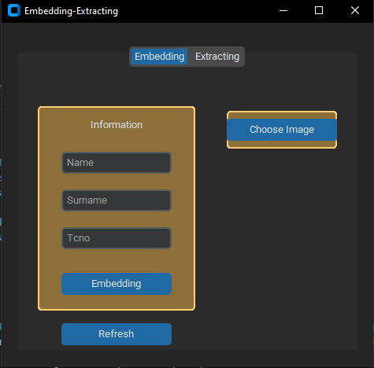
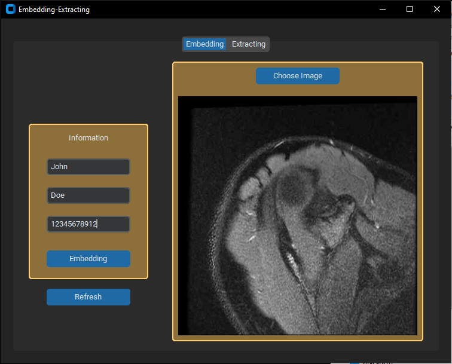
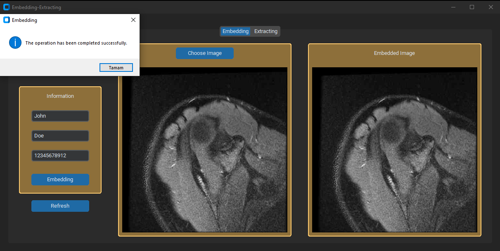
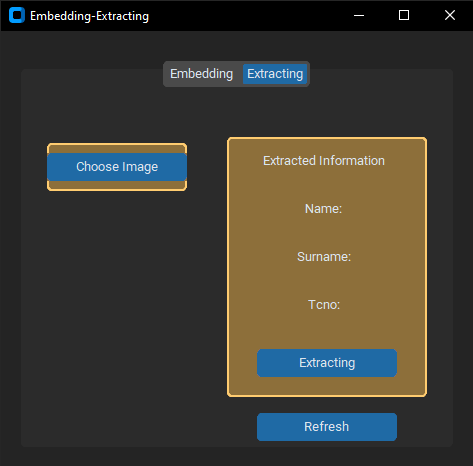
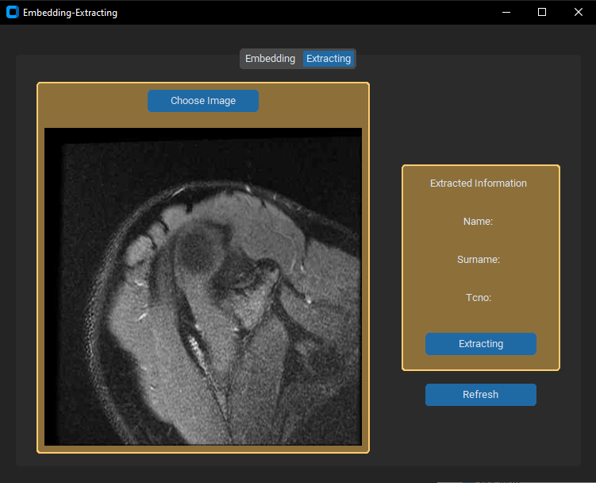
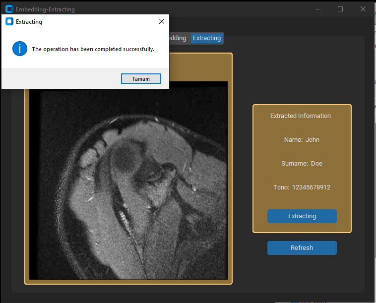

# A secure system by combining encryption for data transfer and information hiding techniques for data authentication.

# Secure Data Transfer and Information Hiding Project

## Overview
This project aims to explore security mechanisms, focusing on data transfer encryption and information hiding techniques for data authentication. The goal is to develop a program that securely embeds personal information into a gray scale medical image and later extracts that information from the modified image.

## Project Features
- **Encryption Algorithm**: The project includes the design and implementation of an encryption algorithm for securing personal information.
- **Cipher Algorithms**
- **Image Modification (Embedding)**: Personal information will be embedded into a gray scale medical image using the designed algorithm.
- **Information Extraction**: The program will be capable of extracting personal information from the modified gray scale medical image.
- **GUI**: A user interface was designed to use the program

## Getting Started
## Prerequisites
- Python 3.12.0
## GUI Embedding

### Main Embedding Page

### Before clicking the embedding button

### After Clicking the embedding button

## GUI Extracting

### Main Extracting Page

### Before clicking the extracting button

### After Clicking the extracting button

### Required Python Libraries
- cffi: 1.16.0
- cryptography: 41.0.7
- numpy: 1.26.2
- opencv-python: 4.8.1.78
- Pillow: 10.1.0
- pycparser: 2.21
- ttkthemes: 3.2.2
- customtkinter: 5.2.1
- darkdetect: 0.8.0
- packaging: 23.2
- easygui: 0.98.3
